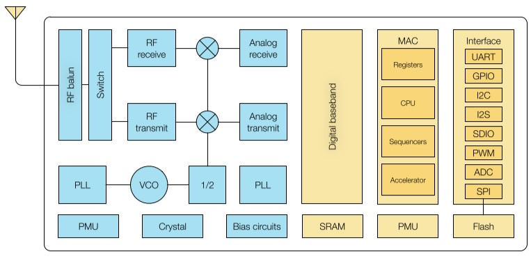

# [ESP8266](https://github.com/sochub/ESP8266) 
 
#### 厂商：[espressif](https://github.com/sochub/espressif)
#### 架构：[MIPS](https://github.com/sochub/MIPS)
## [描述](https://github.com/sochub/ESP8266/wiki) 

ESP8266内置超低功耗 Tensilica L106 32 位 RISC 处理器，CPU 时钟速度最高可达 160 MHz，可将高达 80% 的处理能力留给应用编程和开发。

#### IRAM 空间为 64 KB：

前 32 KB 用作 IRAM，用来存放没有加 ICACHE_FLASH_ATTR 的代码，即 .text 段，会通过 ROM code 或二级 boot 从 SPI Flash 中的 BIN 中加载到 IRAM。

后 32 KB 被映射作为 iCache，放在 SPI Flash 中的，加了 ICACHE_FLASH_ATTR 的代码会被从 SPI Flash 自动动态加载到 iCache。

#### DRAM 空间为 96 KB：

对于 Non-OS_SDK，前 80 KB 用来存放 .data/.bss/.rodata/heap，heap 区的大小取决于 .data/.bss/.rodata 的大小；还有 16 KB 给 ROM code 使用。

对于 RTOS_SDK，96 KB 用来存放 .data/.bss/.rodata/heap，heap 区的大小取决于 .data/.bss/.rodata 的大小。

 

主要特点：低成本高性能SOC，集成WiFi

器件封装： QFN32 (5mm x 5mm)

### [收录资源](https://github.com/sochub/ESP8266)

* [文档](docs/)
* [工程](project/)
* [工具](tools/)
* [环境](env/)

### [关联资源](https://github.com/sochub)

* [xtensa开发环境](https://github.com/sochub/xtensa)
* [xtensa-lx106编译](https://github.com/sochub/xtensa-lx106)

### [选型建议](https://github.com/sochub)

* [ESP32](https://github.com/sochub/ESP32) 

*  [RTL8710](https://github.com/sochub/RTL8710)

*  [RDA5981](https://github.com/sochub/RDA5981)

###  [SoC资源平台](http://www.qitas.cn)
