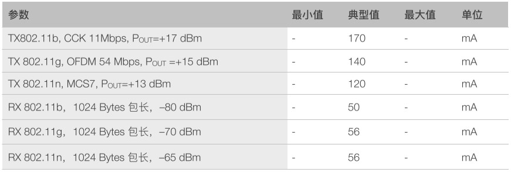

# [ESP8266](https://github.com/sochub/ESP8266) 

 

#### [Vendor](https://github.com/sochub/Vendor)：[Espressif](https://github.com/sochub/espressif)
#### [MIPS](https://github.com/sochub/MIPS)：[Tensilica](https://ip.cadence.com/ipportfolio/tensilica-ip) [Xtensa L106](https://github.com/sochub)
#### [Level](https://github.com/sochub/Level)：1.22DMIPS/MHz x 160MHz

## [芯片描述](https://github.com/sochub/ESP8266/wiki) 

[ESP8266](https://github.com/sochub/ESP8266) 内置超低功耗 Tensilica L106 32 位 RISC 处理器，CPU 时钟速度最高可达 160 MHz，可将高达 80% 的处理能力留给应用编程和开发。

扩展型号[ESP8285](https://github.com/sochub/ESP8266)在封装不变的情况下内置1MB flash，可以实现更紧凑的板上设计。

 

### 关键参数

 

* 1T1R 802.11 b/g/n，support WPA/WPA2，Support STA/AP/STA+AP
* +20dBm in 802.11b；STBC, 1x1 MIMO, 2x1 MIMO
* Integrated TR switch, balun, LNA, power amplifier and matching network
* SDIO 2.0, (H) SPI, UART, I2C, I2S, IR Remote Control, PWM, GPIO

#### 功率参数

* Deep sleep <10uA, Power down< 5uA，Standby < 1.0mW (DTIM3)，Wake up and transmit packets in < 2ms

 

### [收录资源](https://github.com/sochub/ESP8266)

* [文档](docs/)
* [示例](project/)
* [工具](tools/)
* [环境](espressif/)

### 封装规格

ESP8266封装： QFN 32 (5mm x 5mm)
ESP8285封装： QFN 32 (5mm x 5mm)

 

### 内存分析

* IRAM 空间为 64 KB

前 32 KB 用作IRAM，用来存放没有加 ICACHE_FLASH_ATTR 的代码，即 .text 段，会通过 ROM code 或二级 boot 从 SPI Flash 中的 BIN 中加载到 IRAM。

后 32 KB 被映射作为 iCache，放在 SPI Flash 中的，加了 ICACHE_FLASH_ATTR 的代码会被从 SPI Flash 自动动态加载到 iCache。

* DRAM 空间为 96 KB

对于 Non-OS_SDK，前80 KB 用来存放 .data/.bss/.rodata/heap，heap 区的大小取决于 .data/.bss/.rodata 的大小；还有 16 KB 给 ROM code 使用。

对于 RTOS_SDK，96 KB 用来存放 .data/.bss/.rodata/heap，heap 区的大小取决于 .data/.bss/.rodata 的大小。

### [关联资源](https://github.com/sochub)

* [ESP8266_RTOS_SDK](https://github.com/espressif/ESP8266_RTOS_SDK)
* [ESP8266_NONOS_SDK](https://github.com/espressif/ESP8266_NONOS_SDK)
* [esp-open-rtos](https://github.com/SuperHouse/esp-open-rtos)
* [esp-open-sdk](https://github.com/pfalcon/esp-open-sdk)

#### [整合资源](https://github.com/sochub)

* [platform H8](https://github.com/OS-Q/H8)
* [xtensa-lx106 编译器](https://github.com/sochub/xtensa-lx106)

### [选型建议](https://github.com/sochub)

[ESP8266](https://github.com/sochub/ESP8266)是开源软硬件中最具影响力的一颗WiFi SoC，拥有了arduino平台的很多资源，全球大量创客共同维护了大量的经典示例和开发资源，十分适合demo产品构建。其后续功能增强的[ESP32](https://github.com/sochub/ESP32)同样拥有不俗的表现。

[ESP8266](https://github.com/sochub/ESP8266)系列产品的主要短板在于无线通信的稳定性，相较于传统的通信厂商产品，WiFi的连接质量相对更差，同时对于没有相关开发经验的人来说，入门的门槛相对高。

相应竞品包括[RTL8710](https://github.com/sochub/RTL8710)和 [RDA5981](https://github.com/sochub/RDA5981)，两者都是基于[Cortex M](https://github.com/sochub/CM)内核开发，更偏向主流的产品开发。

###  [SoC资源平台](http://www.qitas.cn)   
